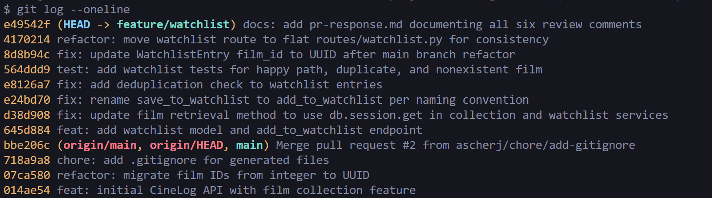

# PR Response Doc — CineLog Watchlist Feature

## AI Usage

- Codebase orientation — to explain and give an overview of the architecture and the different features (e.g. what `add_to_collection()` does and how the tests are structured) before I started making changes.

- I asked Claude to act as a devil's advocate on my Comment 4 & 5 (default visibility) response — to point out flaws, weak spots, and strong points in my argument. 

-  Used to refine this PR Response Doc — correcting typos and grammar, and highlighting places where my documentation was missing details or call sites I hadn't mentioned. 

## Comment 1 — Rename
**What I did:** Renamed `save_to_watchlist()` to `add_to_watchlist()` in `services/watchlist_service.py` (the definition) and updated its one call site in `routes/watchlist/watchlist.py` — both the `import` on line 8 and the call inside the `/add` endpoint on line 32.
**How I verified:** Ran a project-wide search (editor find-all-references) for `save_to_watchlist` and got zero remaining matches, confirming no call site was missed. Then ran `pytest tests/ -v` — all tests passed.

## Comment 2 — Deduplication
**What I did:** Added deduplication logic to `add_to_watchlist()` following the existing pattern in `add_to_collection()` (`services/collection_service.py`): after confirming the film exists, query for an existing `WatchlistEntry` with the same `user_id` and `film_id` and raise if one is found. Defined a dedicated `AlreadyInWatchlistError` exception rather than reusing the collection error, so the semantics are correct.
**How I verified:** Wrote `test_add_to_watchlist_duplicate_raises` (Comment 3), which adds the same film twice, asserts the second call raises `AlreadyInWatchlistError`, and confirms only one row exists. Ran `pytest tests/ -v` — all pass.

## Comment 3 — Missing test
**What I did:** Created `tests/test_watchlist.py`, modeled on `tests/test_collection.py` — reused the `app`, `sample_user`, and `sample_film` fixtures. Wrote the required nonexistent-film test `test_add_to_watchlist_nonexistent_film_raises`.
**How I verified:** Ran the full `pytest tests/ -v` — all 7 tests pass.

## Comment 4 — Default visibility
**My position:** `public` should default to `False`.
**Reasoning:** I believe users should actively choose to make a list public rather than have it happen automatically. Defaulting to `True` assumes consent that the user never gave — some users won't realize their watchlist is public, which quietly hurts their privacy. Making privacy the default is the safer, more intentional choice. This matters specifically for CineLog: a person's taste in films is personal. Some users are embarrassed by what they watch, and others feel deeply connected to it, and in both cases they may not want that exposed to strangers by default. A watchlist also reveals what someone *intends* to watch, which is arguably more revealing than the films they've already logged.

**Tradeoff acknowledged:** Defaulting to `True` drives more social activity in the app (public lists are discoverable and shareable), and we lose some of that by defaulting to private. Some users genuinely enjoy sharing and would prefer public by default. I'm accepting that tradeoff because protecting the privacy of users who don't opt in matters more than the convenience of those who do — and the latter group can still switch to public with one action.

## Comment 5 — Sort order
**My position:** I agree with the maintainer — the watchlist should be sorted by date added (newest first) rather than alphabetically by title.
**Reasoning:** Most users come back to their watchlist to pick something to watch next, and the films they added most recently are usually the ones freshest in their mind and most likely to be chosen. Putting recent additions at the top gives quick access to what they actually care about right now. There's also a natural lifecycle to the list: once a user watches a film it gets removed from the watchlist, so if something has been sitting unwatched for a long time, that's a signal the user may have lost interest in it. It's fine for those stale entries to sink toward the bottom — they're the least relevant, so the sort order matches how interest actually decays.
**Engagement with reviewer's point:** The maintainer's point is that date-added surfaces relevance, and I think that's correct for a watchlist specifically. Alphabetical order is predictable, but it optimizes for *looking up a title you already know*, which isn't the main way people use a "what should I watch" list — and it arbitrarily rewards films whose titles start with "A" regardless of when or why they were added. This also brings the watchlist in line with `get_collection()`, which already sorts by `date_added` descending, so the two lists behave consistently.

## Comment 6 — Rebase
**Conflicts:** 2 things: `.gitignore` conflicted because both branches added entries. `models.py` conflicted because `main` changed `Film.id` and related `film_id` fields from integers to UUID strings, while my branch still used integers and added a new `WatchlistEntry` model.

**Resolution:** I combined the `.gitignore` entries. In `models.py`, I kept the UUID-based definitions from `main` and updated `WatchlistEntry` to use `db.String(36)` for `film_id` with the proper foreign key. I also manually restored `WatchlistEntry`, since Git removed it without showing a conflict.

**Verification:** I checked for leftover conflict markers, confirmed the rebase created no merge commits, verified that all ID fields use UUID strings, and ran the tests and application startup successfully.

## PR Description

**What it does:** Adds a watchlist feature that lets users save films to watch later. `add_to_watchlist(user_id, film_id)` adds a film (while preventing duplicates and invalid film IDs), and `get_watchlist(user_id)` returns the user’s saved films. The feature is available through `GET /watchlist/<user_id>` and `POST /watchlist/<user_id>/add`.

**Design decisions (documented positions — see Comments 4 and 5):**

* **Visibility default:** I argue `public` should default to `False` so users opt in to sharing rather than being public without knowing it. (Full reasoning in Comment 4.)
* **Sort order:** I agree with the maintainer that the watchlist should be sorted by date added (newest first), since that matches how users pick what to watch next. (Full reasoning in Comment 5.)

**Manual testing:**

1. Start the app with `python app.py`.
2. Send a `POST` request to `/watchlist/<user_id>/add` with a valid `film_id`; you should receive a `201` response.
3. Repeat the same request; it should be rejected as a duplicate.
4. Send a `GET` request to `/watchlist/<user_id>` and verify that the saved films are returned.
5. Run `pytest tests/ -v` and confirm that all tests pass.

## Commit History

